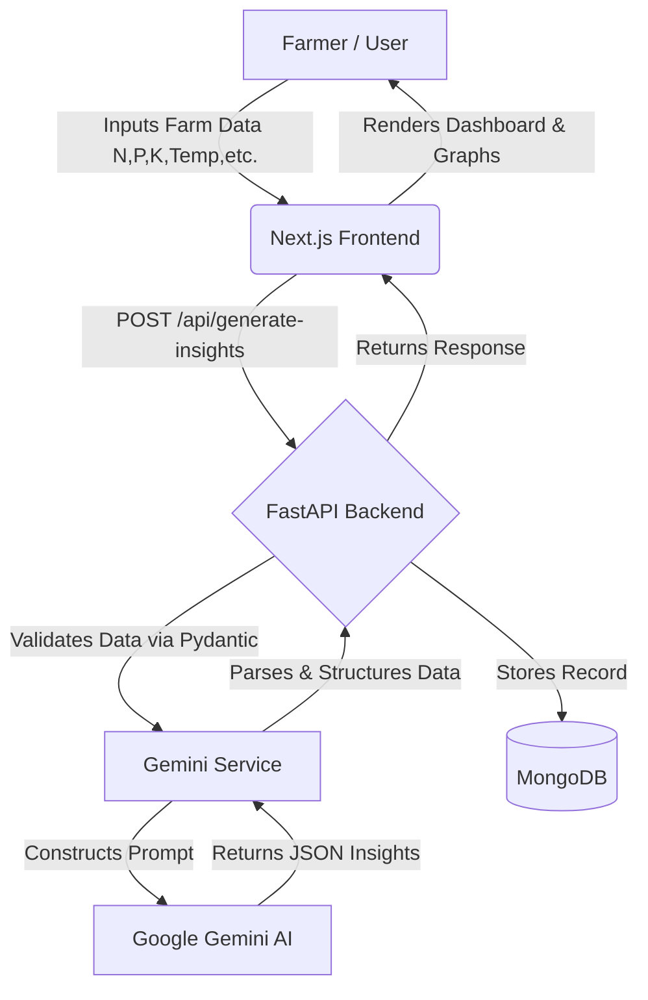
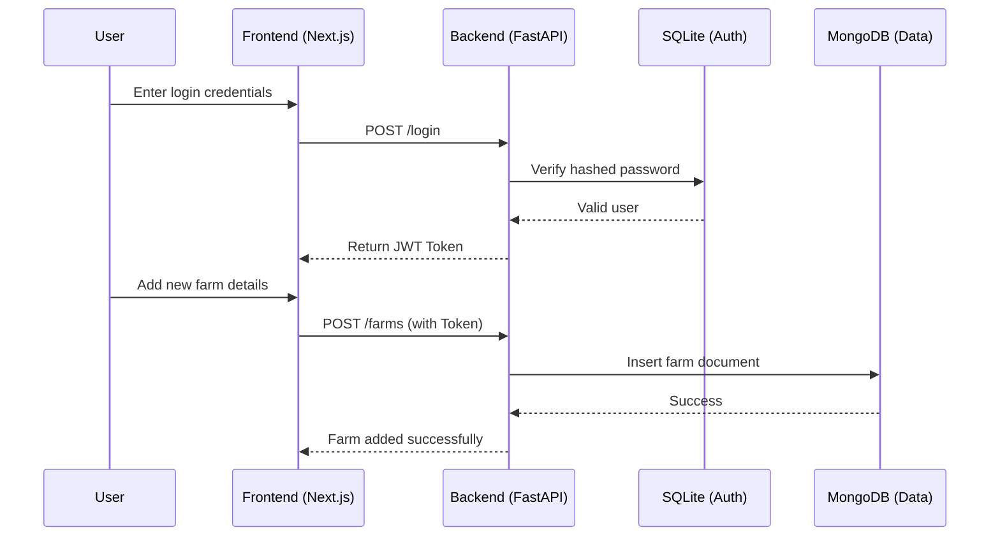

# AI Agriculture Portal: Project Report

## 1. Introduction

With the rising global population and changing climate conditions, traditional farming methods are becoming increasingly insufficient to meet the world's food demands. Precision agriculture, driven by Data Science, Internet of Things (IoT), and Artificial Intelligence (AI), has emerged as a vital solution to optimize resource usage and maximize crop yields. The AI Agriculture Portal is a comprehensive web application designed to empower farmers and agricultural stakeholders by providing data-driven, actionable insights based on environmental and soil metrics. By centralizing farm data and leveraging advanced Large Language Models (LLMs), the portal acts as an intelligent agronomy assistant.

---

## 2. Theory

### Problem Statement
**Design a Data Science system for smart agriculture using IoT and AI to improve crop yield.**

### Our Solution
To address the aforementioned problem, we developed a full-stack, AI-integrated software system composed of a React-based frontend (Next.js) and a Python backend (FastAPI). The solution focuses on analyzing specific, quantifiable farm parameters—Nitrogen (N), Phosphorus (P), Potassium (K), Temperature, Humidity, Rainfall, and pH levels—and feeding these into an advanced AI model (Google Gemini).

The system solves the problem through the following mechanisms:
1. **Data Centralization:** Farmers can digitalize their farm properties and record key environmental and soil metrics in a structured MongoDB database.
2. **Predictive Analytics:** Using AI, the system predicts realistic crop yields based on input metrics, comparing them against optimal growing conditions.
3. **Risk Management:** The AI conducts a risk analysis, categorized into low, medium, and high risks, providing specific reasons (e.g., adverse pH or insufficient nitrogen).
4. **Actionable Recommendations:** Instead of generic advice, our platform generates specific, tailored recommendations for fertilization, irrigation, and crop care.
5. **Visualization:** By computing nutrient and weather impact data, the portal generates visual graphs that make complex data easily interpretable for the end-user.

---

## 3. Methodology

The methodology for building the AI Agriculture Portal involves a decoupled architecture, clearly separating the user interface, backend processing, database management, and AI integration.

### 3.1 Architecture Overview

The system is built on modern web technologies:
- **Frontend:** Next.js (TypeScript, React UI components) for a responsive, interactive dashboard and insight reports.
- **Backend:** FastAPI (Python) for high-performance API endpoints and data validation using Pydantic schemas.
- **Databases:** A dual-database strategy employing **SQLite** for secure, structured user authentication and **MongoDB** for flexible, document-based storage of crop data, user profiles, farms, and AI insights.
- **AI Engine:** Google Generative AI (Gemini) integrated via a custom prompt-building service to generate structured JSON insights.

### 3.2 System Workflows

#### Data Flow Diagram
The following diagram illustrates how user input travels through the system to generate insights:



#### User Authentication and Farm Setup Flow



### 3.3 Core Code Implementation Examples

**AI Prompt Construction & Integration (`gemini_service.py`)**

The heart of the intelligent insights is the prompt builder that forces the LLM to act as an agronomy system and return strict JSON:

```python
def _build_prompt(crop_type, nitrogen, phosphorus, potassium, temperature, humidity, rainfall, ph_level):
    return f"""
You are an advanced agricultural intelligence system trained in agronomy, crop science, and predictive analytics.
Your task is to analyze structured farm data and return ONLY valid JSON.

INPUT DATA:
Crop: {crop_type}
Temperature: {temperature} °C
Humidity: {humidity} %
Rainfall: {rainfall} mm
Soil:
  Nitrogen: {nitrogen}
  Phosphorus: {phosphorus}
  Potassium: {potassium}
pH: {ph_level}

TASKS:
1. Predict realistic yield (kg)
2. Analyze risk level (low/medium/high) with reasons
3. Generate actionable recommendations (specific, not generic)
4. Define optimal conditions for this crop
5. Generate data for frontend visualizations
...
"""
```

**MongoDB Connection Setup (`mongo.py`)**

Using `pymongo`, we connect to collections dynamically for unstructured insights:

```python
from pymongo import MongoClient
from app.core.config import settings

mongo_client = MongoClient(settings.MONGO_URL)
mongo_db = mongo_client["agri_portal"]

# Collections
crop_collection = mongo_db["crop_data"]
farms_collection = mongo_db["farms"]
insights_collection = mongo_db["insights"]
```

### 3.4 Platform Interface Highlights

<!-- SCREENSHOT: Insert picture of the Login/Registration Page here -->

<!-- SCREENSHOT: Insert picture of the Main Dashboard showing Farm Overviews here -->

<!-- SCREENSHOT: Insert picture of the Crop Insights Report with Graphs here -->

---

## 4. Current Trends / Future Scopes

### Current Trends Addressed
- **Precision Agronomy:** Shifting from generalized farming to specific, square-meter-level data analysis.
- **LLM in Agriculture:** Utilizing advanced natural language models to parse complex agronomic rules into easily digestible advice for farmers.
- **Cloud-Based Farm Management:** Centralizing data so it can be accessed from any device, anywhere.

### Future Scope
1. **IoT Hardware Integration:** The original problem statement mentions IoT. The next logical step is to replace manual data entry with live data feeds from hardware IoT sensors (soil moisture probes, Arduino-based weather stations) deployed directly in the fields.
2. **Drone Imagery & Computer Vision:** Integrating satellite or drone imagery to detect crop health anomalies, pest infestations, or varying moisture levels visually.
3. **Automated Actuation:** Linking the AI output directly to farm machinery, such as automatically adjusting smart-irrigation valves based on the predicted rainfall and current soil humidity.
4. **Market & Supply Chain Analytics:** Connecting crop yield predictions to real-time market pricing to advise farmers not just on *how* to grow, but *when* to sell.

---

## 5. Conclusion

The AI Agriculture Portal successfully implements a scalable, modern Data Science and software engineering solution to tackle challenges in agricultural yield optimization. By bridging the gap between raw soil/weather data and actionable intelligence using Google Gemini AI, the system provides farmers with crucial foresight regarding risks, optimal conditions, and expected outcomes. As the platform transitions towards direct IoT sensor integrations in the future, it holds the potential to become a fully automated, closed-loop smart farming ecosystem that significantly enhances global food security and farming efficiency.
